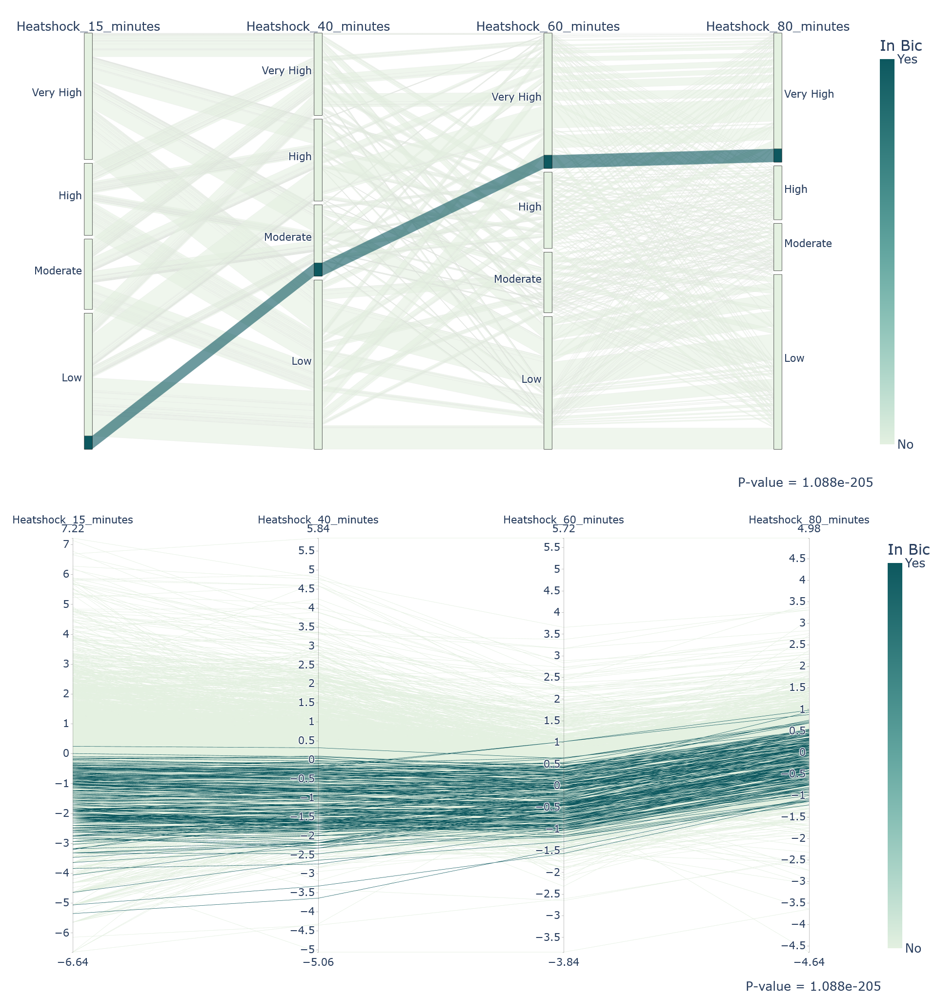
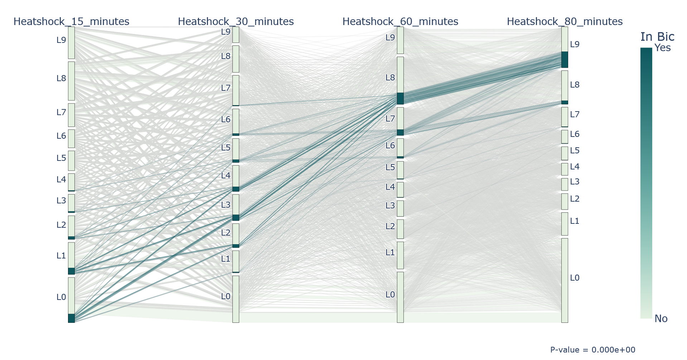
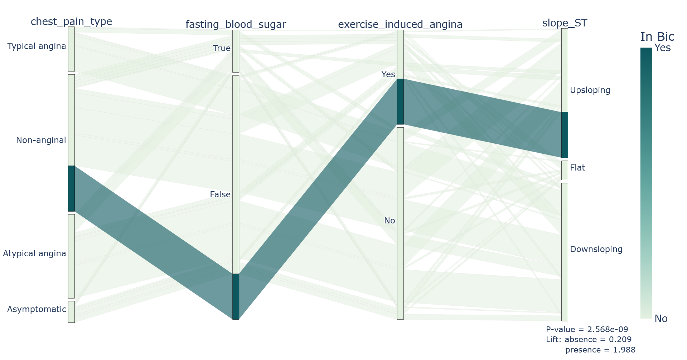

# bic_parallel_coords

This repository contains code to generate parallel coordinates and parallel categories plots for bicluster visualization.

Published in the Proceedings of the 2022 International Conference on Advanced Visual Interfaces (AVI 2022), June 6--10, 2022, Frascati, Rome, Italy

DOI: [10.1145/3531073.3531124](https://doi.org/10.1145/3531073.3531124)

---
### Main Highlights

* Dealing with multiple datatypes.

* Representing order preserving patterns.

* Representing discriminative patterns (with lift information).

---

### Usage Instructions
1. Place your dataset files in the data/input/ directory.
    *  The file's name should be suffixed with either "_categories" or "_coordinates", according to the plot type.
    *  Currently, only .arff, .csv, and .txt data files are supported (see the examples provided).
2. Place your bicluster files in the data/output/ directory.
    * The file's name should be the same as the input file without the suffix, for correspondence reasons.
    * Currently, only BicPAMS output result files are supported (feel free to override the load_biclusters() in the BiclusterVisualizer class).
3. Run the script with the following command:
    * python3 test.py
 
---

### Requirements
* Python 3.9
* Plotly 5.5.0
* Pandas 1.2.4
